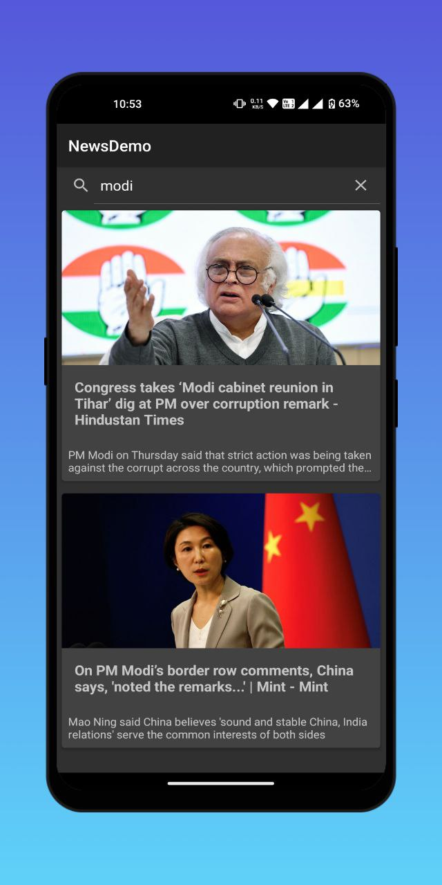

 

  <h3 align="center">NewsApp Demo</h3>

  

    A demo app written in  written in kotlin, demonstrating the use of newsapi.org.
     
     
  

   

## About The Project

The News App Demo is an app for educational purposes, designed to illustrate the integration of the powerful NewsAPI.org into a mobile application. Through this demo, users can explore the functionalities of accessing real-time news data, providing a hands-on learning experience in modern app development and API utilization.

## Built With

Built with Kotlin, NewsAPI.org integration, and leveraging JSoup and Retrofit frameworks for seamless news data retrieval and parsing.

1. Clone the Repository:
    Open Android Studio.
    Go to File > New > Project from Version Control.
    In the dialog, select Git from the Version control dropdown.
    Paste the clone URL from GitHub into the URL field. You can find this URL on the repository's homepage under the green Code button.
    Choose a local directory where you want to save the cloned project on your computer.
    Click Clone.

2. Open the Cloned Project:
    Android Studio will download the project files. Once finished, it will ask you how to open the project.
    Select Open to import the project into Android Studio.

3. Sync and Build the Project:
    Android Studio will analyze the project and dependencies. This might take a few minutes.
    In the bottom right corner of the Android Studio window, you'll see a progress bar with syncing status. Wait for it to finish.
    Once synced, look for a Build menu option at the top of the window.
    Common options include Build > Make Project or Build > Rebuild Project. Choose the appropriate option based on any previous builds.

4. Run the App:
    After a successful build, you can run the app on an emulator or connected device.
    In the toolbar, click the Run icon (usually a green play button).
    Choose a device or emulator to run the app on.

## Issues
- The Testcases are added but have some issues which is under progress
- Articles searched using searchbar cannot be opened in the detailed view

## License

Distributed under the MIT License. See [LICENSE](https://github.com/LordShenron/newsAppDemo/blob/main/LICENSE.md) for more information.

## Authors

* **Priyanshu** - *A full time Android engineer* - [Priyanshu](https://github.com/LordShenron) - *newsAppDemo*
